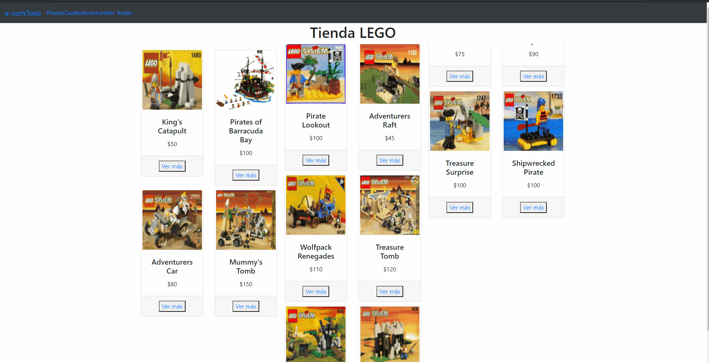

## EcomToso

Este es mi proyecto final del curso de ReactJS en Coderhouse.
Mi idea fue realizar un ecommerce para la venta de producto LEGO®

## Librerías utilizadas y sus versiones

- bootstrap: 4.6.0
- bootstrap-icons: 1.5.0
- firebase: 8.8.1
- react: 17.0.2
- react-bootstrap: 1.6.0
- react-dom: 17.0.2
- react-hook-form: 7.12.2
- react-router-dom: 5.2.0
- react-scripts: 4.0.3

## Navegabilidad del sitio

